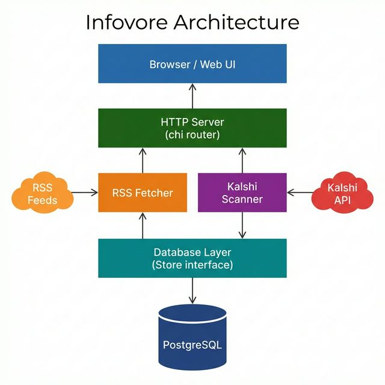

# Architecture

Infovore is a monolithic Go web application with two integrated subsystems: an **RSS Reader** and a **Kalshi Market Scanner**. Both share a single HTTP server, database, and configuration layer.

## Architecture Diagram



## Package Layout

```
infovore/
├── main.go                          Application entry point
├── internal/
│   ├── model/model.go               Shared data types (Folder, Feed, Item)
│   ├── database/
│   │   ├── store.go                 Store interface (30+ methods)
│   │   └── postgres.go              PostgreSQL implementation + migrations
│   ├── rss/
│   │   └── fetcher.go               Feed fetching, parsing, and polling
│   ├── opml/
│   │   └── opml.go                  OPML import/export
│   ├── server/
│   │   ├── server.go                HTTP server, route setup, all handlers
│   │   ├── kalshi.go                KalshiManager (scheduler + API handlers)
│   │   ├── templates/               HTML templates (embedded via go:embed)
│   │   │   ├── shell.html           Main tabbed shell container
│   │   │   ├── layout.html          RSS reader layout
│   │   │   └── settings.html        Settings/configuration page
│   │   └── static/                  Static assets (embedded)
│   │       ├── css/style.css        Main stylesheet
│   │       ├── css/theme.css        Theme variables
│   │       ├── js/app.js            Reader UI logic
│   │       └── js/settings.js       Settings page logic
│   └── kalshi/
│       ├── auth/signer.go           RSA-PSS request authentication
│       ├── client/client.go         HTTP API client (rate-limited)
│       ├── config/config.go         Configuration (env vars + DB)
│       ├── models/                  API data types (Market, Portfolio, etc.)
│       └── scanner/
│           ├── scanner.go           Price filtering and sorting
│           ├── kelly.go             Kelly Criterion calculations
│           ├── report.go            HTML report template generation
│           └── run.go               RunScan() orchestration function
```

## Core Components

### Server (`internal/server`)

The HTTP server uses [chi](https://github.com/go-chi/chi) as a router with logging, recovery, and compression middleware. It embeds HTML templates and static assets at compile time via `go:embed`, making the binary fully self-contained.

The UI is a tabbed shell (`shell.html`) that frames the Reader, Markets page, and Settings in iframes. The Reader pages are server-rendered using Go templates.

**Key struct**: `Server` — holds the database connection, RSS fetcher, poller, Kalshi manager, router, and template engine.

### Database (`internal/database`)

All persistence goes through the `Store` interface, which defines 30+ methods covering folders, feeds, items, settings, and Kalshi reports/logs. The sole implementation is `PostgresStore`.

**Auto-migration**: On startup, `NewPostgres()` runs DDL statements to create all tables and seed default settings if they don't exist. No external migration tool is needed.

**Tables**: `folders`, `feeds`, `items`, `settings`, `kalshi_reports`, `kalshi_scan_log`.

### RSS Fetcher (`internal/rss`)

`Fetcher` handles downloading and parsing RSS/Atom feeds using the [gofeed](https://github.com/mmcdole/gofeed) library. It implements:

- **Domain-level rate limiting** — Limits concurrent requests per domain (2 max) with a 500ms minimum delay between requests to the same host.
- **Parallel or sequential modes** — PostgreSQL uses parallel workers; the system adapts based on `SupportsHighConcurrency()`.
- **De-duplication** — Items are de-duped by GUID via `INSERT ... ON CONFLICT DO NOTHING`.

`Poller` wraps the Fetcher for scheduled background polling (not started by default — manual refresh is preferred).

### Kalshi Scanner (`internal/kalshi`)

A five-package subsystem for interacting with the [Kalshi](https://kalshi.com) prediction market API:

| Package | Purpose |
|---------|---------|
| `auth` | RSA-PSS request signing (supports both file-based and byte-based keys) |
| `client` | Authenticated HTTP client with rate limiting (20 req/sec) |
| `config` | Load credentials from environment variables or database settings |
| `models` | Go structs for API responses (Market, Position, Settlement, Fill, Series) |
| `scanner` | Market filtering, Kelly Criterion analysis, and HTML report generation |

**KalshiManager** (`server/kalshi.go`) runs a background goroutine that:
1. Checks every 5 minutes if a scan is due (based on `kalshi_scan_interval_hours`)
2. Loads configuration from the database
3. Calls `scanner.RunScan()` to fetch markets, filter by price, and generate an HTML report
4. Stores the report and scan log in the database

### OPML (`internal/opml`)

Standard [OPML 2.0](http://opml.org/spec2.opml) import/export for feed subscriptions. Supports nested folder hierarchies.

## Key Design Decisions

1. **Single binary deployment** — All templates, CSS, and JS are embedded. Only dependency is a PostgreSQL connection.
2. **PostgreSQL only** — Chosen for its concurrency support and JSON capabilities. SQLite support was removed.
3. **Database-centric configuration** — Kalshi API credentials are stored in the `settings` table, not in files.
4. **No external migration tool** — DDL is inlined in `postgres.go`, executed on startup.
5. **Interface-driven storage** — The `Store` interface allows alternative backends (though only PostgreSQL is currently implemented).

## Technology Stack

| Component | Technology |
|-----------|-----------|
| Language | Go 1.22 |
| HTTP Router | [chi/v5](https://github.com/go-chi/chi) |
| Database | PostgreSQL via [lib/pq](https://github.com/lib/pq) |
| RSS Parsing | [gofeed](https://github.com/mmcdole/gofeed) |
| Templates | Go `html/template` (embedded) |
| Frontend | Vanilla HTML/CSS/JS |
| Container | Multi-stage Docker (golang:1.22 → debian:bookworm-slim) |
