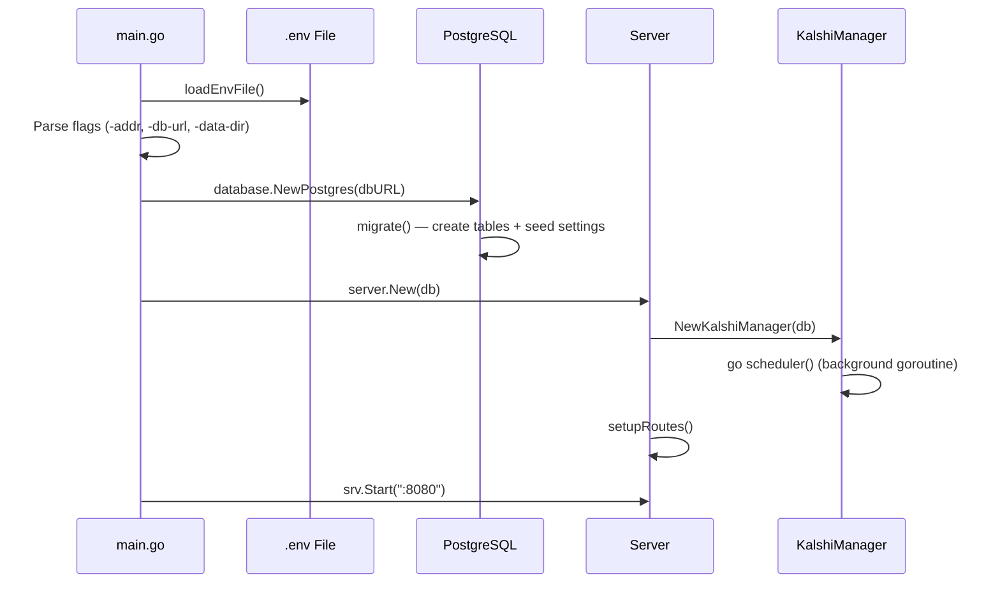
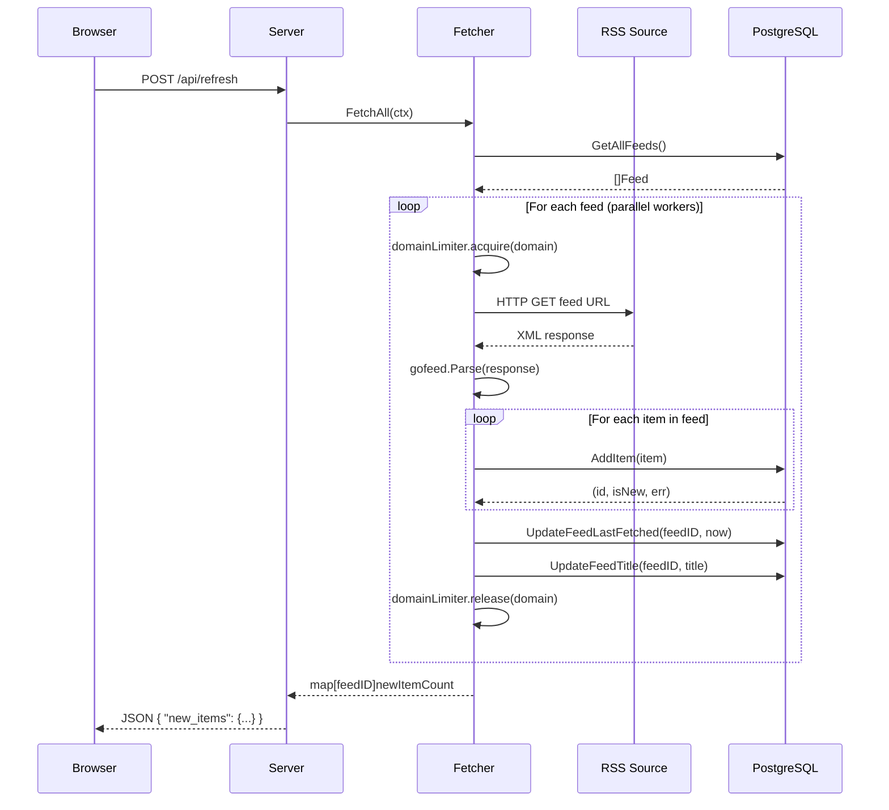
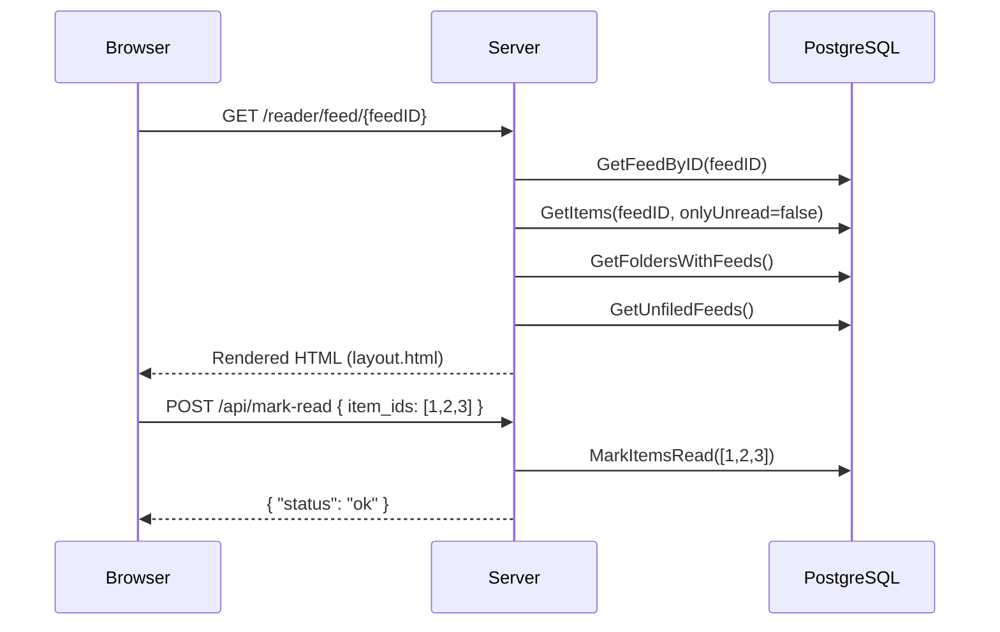
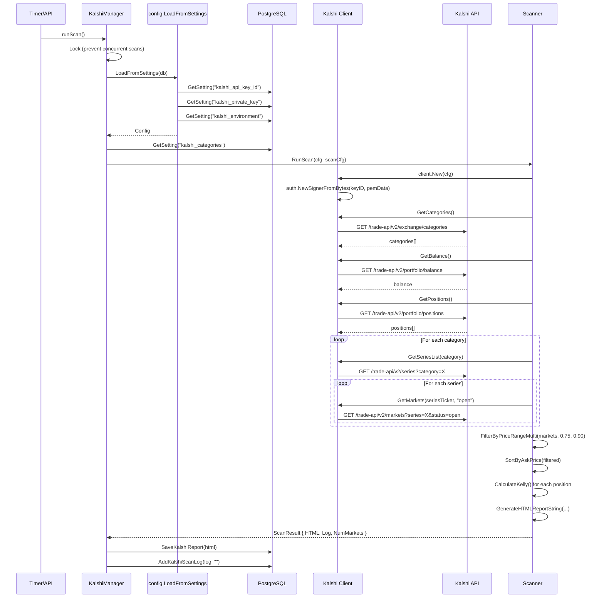
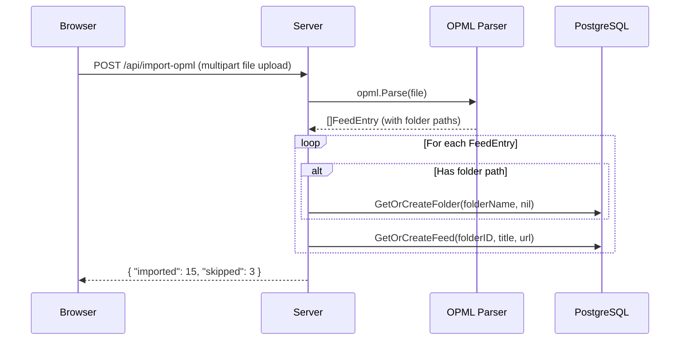
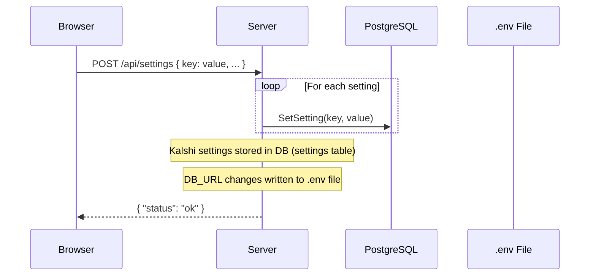
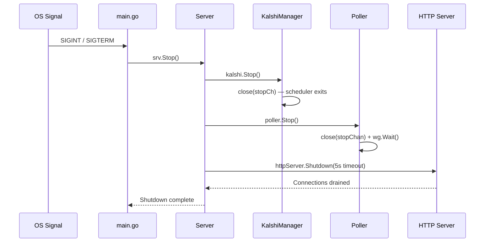

# Data Flows

This document describes the major data flows through the Infovore application.

## 1. Application Startup

**Key points:**
- The `.env` file is loaded first, but environment variables already set take precedence
- PostgreSQL tables are created automatically via the `migrate()` function
- The Kalshi scheduler starts immediately but waits 30 seconds before its first check
- Graceful shutdown is handled via `SIGINT`/`SIGTERM` → `srv.Stop()`

---

## 2. RSS Feed Refresh

**Key points:**
- Feeds are fetched in parallel using a worker pool (8 workers for PostgreSQL)
- Domain-level rate limiting prevents overwhelming any single host (2 concurrent + 500ms delay)
- Items are de-duplicated by GUID — `INSERT ... ON CONFLICT DO NOTHING`
- Feed titles are updated from the feed's metadata on each refresh
- Errors are stored per-feed via `UpdateFeedError()` for UI display

---

## 3. RSS Item Reading

---

## 4. Kalshi Market Scan

**Key points:**
- Scans are triggered either by the background scheduler (every N hours) or manually via `POST /api/kalshi/refresh`
- The scheduler checks every 5 minutes whether enough time has elapsed since the last scan
- Concurrent scans are prevented via a mutex-protected `scanning` flag
- API credentials (API key ID, RSA private key) are loaded from the database `settings` table
- The client uses RSA-PSS (SHA-256) signing for Kalshi API authentication
- Rate limiting is enforced at 20 requests/second (Kalshi Basic tier)
- Reports are stored in `kalshi_reports` (only the 5 most recent are kept)
- Scan logs are stored in `kalshi_scan_log` (only the 20 most recent are kept)

---

## 5. OPML Import

---

## 6. Settings Update

---

## 7. Graceful Shutdown

